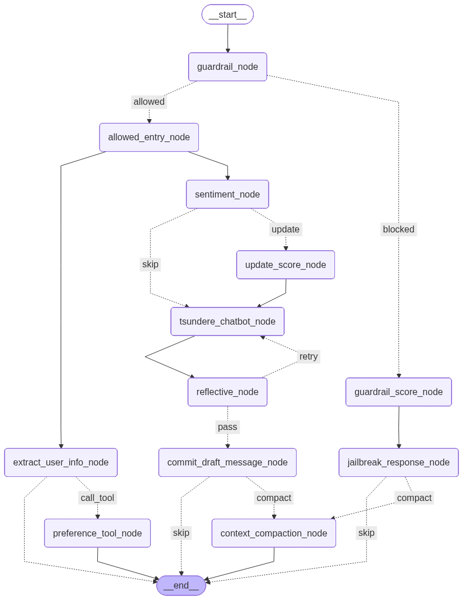

# Tsundere Chatbot API (FastAPI & LangGraph) 👧🏻🎀

[](https://www.python.org/)
[](https://fastapi.tiangolo.com/)
[](https://python.langchain.com/v0.1/docs/langgraph/)
[](https://redis.io/)
[](https://www.docker.com/)


This repository contains a backend service for a **Tsundere Chatbot** driven by a complex agentic flow utilizing LangGraph and powered by low-computational resource LLMs. **The project is heavily focused on the Thai language**, utilizing [`typhoon-v2.5-30b-a3b-instruct`](https://opentyphoon.ai/) for its exceptional fluency and natural understanding of Thai conversational nuances, and [`qwen3.5-flash`](https://www.alibabacloud.com/zh/product/modelstudio/) for robust tool-parsing and internal logic processing. It offers a conversational API designed to exhibit a "Tsundere" personality, alongside features to track user affection scores, apply guardrails, Tsundere-style response, and manage chat sessions using Redis. For fronend repository please refer to [Tsundere Chatbot UI](https://github.com/tentdod9/tsundere_chatbot_ui).

## ✨ Key Features

- **Agentic Flow with LangGraph:** The Tsundere AI's behavior is modeled as a `StateGraph` handling logic such as input guardrails, sentiment analysis, persona selection, and reflective evaluation.
- **Dynamic Persona State (Affection Score):** The system assesses user intent and sentiment (e.g., positive or negative) and adjusts an internal affection score. This score dynamically changes the Tsundere persona's tone (from harsh/cold to affectionate).
- **Safety Guardrails:** Analyzes user input to prevent jailbreaking instructions, dangerous requests, or inappropriate behavior.
- **Self-Reflection Pipeline:** The chatbot's responses are evaluated before being sent to the user to ensure it maintains the correct "Tsundere" persona based on the current affection level.
- **Context Summarization:** Old chat histories are automatically compressed when they exceed limits, maintaining relevance and avoiding context window overflows.
- **Memory & Session Tracking:** Utilizing Redis to persist chat sessions, conversation states, user metadata, and LangGraph checkpoints (`langgraph-checkpoint-redis`).
- **Tool Calling:** Employs Qwen model logic alongside the core conversational LLM to call tools for extracting user's preferences.

## 🏗️ Graph Architecture & Logic

<p align="center">
    
</p>

### 🧩 Node Responsibilities

- **Input Guardrail:** Filters incoming messages to detect and block jailbreak attempts, inappropriate content, or malicious instructions.
- **Jailbreak Attempt/Dangerous Request Response:** Generates a Tsundere-style response to the user based on the rejection reason from the input guardrail.
- **Sentiment & Intent Analysis:** Analyzes the user's emotional tone and purpose to calculate adjustments for the internal **Affection Score**.
- **Affection Score Update:** Updates the affectionscore based on sentiment analysis and interaction streaks. If the user sends consecutive positive messages, the score increases further; conversely, consecutive negative messages result in a additional decrease.
- **Persona Selection:** Dynamically chooses the specific Tsundere behavior profile (ranging from hostile to sweet) based on the current state of the affection score.
- **Tool Calling:** Leverages `qwen3.5-flash` to perform structured data extraction and identify specific user preferences or entities.
- **Response Generation:** Utilizes `typhoon-v2.5-30b-a3b-instruct` to craft natural, fluent Thai responses tailored to the active persona.
- **Self-Reflection:** A secondary check that evaluates the generated response, ensuring it maintains the "Tsundere" character and meets quality standards.
- **Context Summarizer:** Monitors conversation length and automatically condenses history into a concise summary when limits are reached.

### 🎀 Tsundere Persona Modes

The Tsundere's personality shifts dynamically based on the **Affection Score** (-10 to +10), which determines the active persona prompt:

| Mode | Affection Score | Description |
| :--- | :--- | :--- |
| **Hate** | -10 to -6 | Extremely hostile and cold. Uses short, blunt responses to show clear displeasure while maintaining boundaries. |
| **Annoyed** | -6 to -2 | Irritated and sarcastic. Reluctantly helpful but maintains a dismissive attitude with frequent sighs and "Hmph" energy. |
| **Tsun (Classic)** | -2 to 2 | The standard phase. Acts indifferent and stubborn to hide underlying care, using classic defensive lines to mask feelings. |
| **Shy** | 2 to 7 | Softening up. Easily flustered and stuttering, especially when praised. Begins to show genuine concern through a shy, hesitant facade. |
| **Dere (Sweet)** | 7 to 10 | Openly affectionate and caring. While still slightly embarrassed, the "Dere" side dominates with warm words and frequent sweet emojis. |


## 🛠️ Tech Stack

- **Framework:** FastAPI
- **Agent Orchestrator:** LangGraph
- **LLMs:** OpenTyphoon API for conversational capabilities, DashScope (Qwen) for robust tool parsing.
- **Database:** Redis
- **Containerization:** Docker & Docker Compose

## 📂 Project Structure

```text
📦 Tsundere
 ┣ 📂 app
 ┃ ┣ 🐍 main.py                # FastAPI application, REST endpoints logic
 ┃ ┣ 🐍 graph.py               # Core LangGraph builder script (sentiment, tools, guardrail, reflection)
 ┃ ┣ 🐍 persona.py             # AI prompts for the Tsundere persona variations dependent on the score
 ┃ ┣ 🐍 redis_manager.py       # Redis client logic (session lists, affection scores, metadata)
 ┃ ┣ 🐍 sentiment.py           # Specialized prompt blocks for sentiment analysis
 ┃ ┣ 🐍 reflection.py          # Structures and logic for modifying AI responses
 ┃ ┣ 🐍 input_guardrail.py     # Logic to filter out jailbreak attempts
 ┃ ┗ 🐍 context_summarizer.py  # Logic for condensing conversation backlogs into brief summaries
 ┣ 🐳 Dockerfile               # Instructions to build the FastAPI app image
 ┣ 🐳 docker-compose.yml       # Configuration for FastAPI and Redis containers
 ┣ 📜 requirements.txt         # Python dependencies
 ┗ 🔐 .env                     # Environment variables (API Keys, LangSmith config)
```

## 🚀 Quick Start

### 📋 Prerequisites

- **Docker & Docker Compose** installed
- Accounts/API Keys for:
    - [Typhoon](https://opentyphoon.ai/) (`typhoon-v2.5-30b-a3b-instruct`)
    - [Alibaba DashScope](https://www.alibabacloud.com/zh/product/modelstudio/) (`qwen3.5-flash`)
    - [LangSmith](https://www.langchain.com/langsmith) (optional, for tracing)

### ⚙️ Environment Setup

Create a `.env` file in the root directory and provide the necessary API keys:

```env
[optional]
LANGSMITH_TRACING=true
LANGSMITH_ENDPOINT=https://api.smith.langchain.com
LANGSMITH_API_KEY=your_langsmith_api_key
LANGSMITH_PROJECT="Tsundere Chatbot"

OPENAI_API_KEY=your_opentyphoon_api_key
DASHSCOPE_API_KEY=your_dashscope_api_key
```

*(Note: The codebase uses OpenTyphoon endpoint by replacing the base URL of Langchain's `ChatOpenAI` configuration.)*

### 🏃‍♀️‍➡️➡️ Running the Application

This project is fully containerized using Docker Compose.

1. Start the services (FastAPI + Redis):
   ```bash
   docker-compose up --build -d
   ```

2. The FastAPI app will run on `http://localhost:8000`. 
   Redis will be available via Docker's internal network at `redis:6379`.

## 🔌 API Endpoints

### 🟢 `GET /` 
**Health Check**  
Returns `{"status": "ok"}` to verify the service is running.

---

### 🟢 `GET /sessions/list`
**List User Sessions**  
Retrieve a list of chat sessions for a specific user.
- **Query Params**: `user_id`
- **Returns**: `[{"thread_id": "...", "title": "..."}]`

---

### 🟢 `GET /sessions/detail`
**Session Details**  
Retrieve the complete chat history and the current affection score.
- **Query Params**: `user_id`, `thread_id`
- **Returns**: 
  ```json
  [
    [
      {"role": "human", "content": "hello"},
      {"role": "ai", "content": "..."}
    ],
    0.0
  ]
  ```

---

### 🔵 `POST /graph`
**Send Message to Chatbot**  
Send a new user message to the agentic pipeline.
- **Query Params**: `user_input` (string), `user_id` (string), `thread_id` (string)
- **Returns**: 
  ```json
  [
    "The AI's generated response string",
    0.0
  ]
  ```